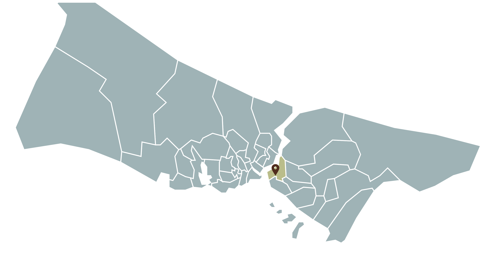

# İstanbul İlçeleri Haritası

Bu proje, İstanbul'un ilçelerini içeren bir haritayı içermektedir. Bu harita, her ilçenin sınırlarını görsel olarak gösterir.

## İçerik

- İstanbul'un tüm ilçeleri
- İlçelerin sınırları ve adları

## Ekran Görüntüsü



## Kullanım

Bu projeyi kendi bilgisayarınızda çalıştırmak için:

1. Bu depoyu klonlayın:

    ```bash
    git clone https://github.com/kullanıcı_adı/istanbul-haritası.git
    ```

2. Proje dizinine gidin:

    ```bash
    cd istanbul-haritası
    ```

3. Proje dosyalarınızı inceleyin ve haritayı görüntülemek için uygun bir program kullanın.

## Kaynak

Bu projede kullanılan Türkiye ilçe haritası verileri için şu kaynağa göz atabilirsiniz:  
[Türkiye SVG İlçe Haritası](https://bqra.github.io/turkiye-svg-ilce-haritasi/)

## Katkıda Bulunma


Katkıda bulunmak isterseniz, lütfen önce projeyi fork'layın ve ardından bir pull request oluşturun. Her türlü katkı değerlidir!

## Lisans

Bu proje MIT lisansı altında lisanslanmıştır. Daha fazla bilgi için `LICENSE` dosyasını inceleyebilirsiniz.
